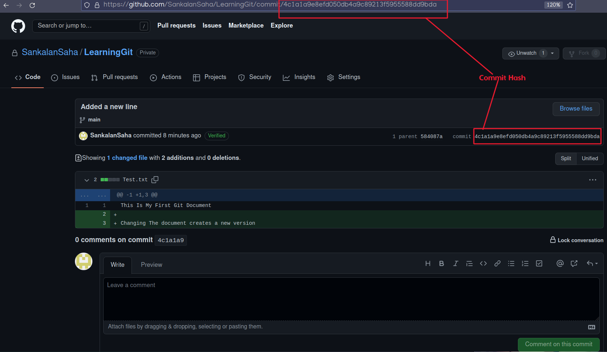

## Commit
**Commit can be seen as "Save File" Option**

## Commit Hash:

## Repository
**Repository is a collection of files in a project**

## Branch
**Branches are used to work on the project following different routes**

## Pull Request

## Merge
**Merging a branch with another one**
